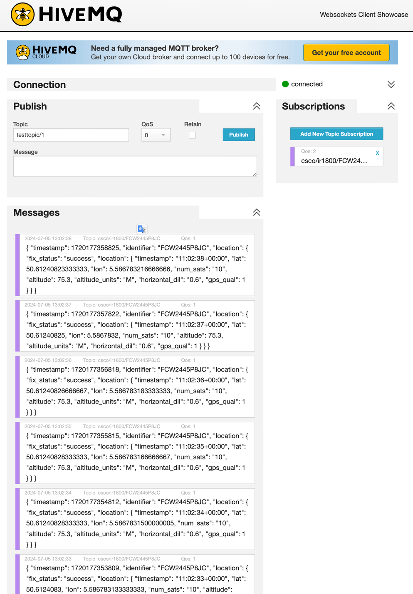

# iox_aarch64_gps

This code will build a Cisco IOx application that runs on a Cisco router such as Cisco IR1101, or Cisco IR1800, and gathers GPS information from a cellular module. It then publishes the GPS information to an MQTT broker. MQTT is highly efficient as it uses a pub/sub model on a broker. By default the public broker `broker.hivemq.com` is used, but this can be changed at run time.

This app is written in Python and uses multi-threaded producer/consumer and a deque (double-ended queue) system as a store-and-forward when network is not available.

This code is based on an initial work done by Kevin Holcomb (Cisco).

## List of Changes
* Using /dev/NMEA0 device as a normal file and not a serial device with pySerial.
* Split the monolithic main code into two threads - the producer gets the GPS data and add it to the queue, the consumer watch the queue and publishes the data to MQTT 
* Added support for local router timestamp as well as GPS-sourced timestamped
* Added a build process that will automatically increate the IOx app version number for each build (build.sh)
* Reduce app size from 40MB to 23MB by disabling APK caching, and removing what's not needed


## Todo or Unfinished
* Queue system will store the last position fix while unable to send data (store and forward)
* Implement multi-queue mechanism to have multiple independant consumers active (ie: MQTT and HTTP and Splunk)

## Building the Code

### Prerequisites

This code has been build on a Linux machine, but it will work on any variant. 

* You need ioxclient to be installed and in your path. Download ioxlcient from here: https://developer.cisco.com/docs/iox/iox-resource-downloads/
* You will need Docker to be installed on the build computer.
* You will need Docker to be able to use buildx components and cross-compile if you are building on non-ARM computer, such as x86_64.

## Router prerequisites

* A Cisco router with a cellular [Pluggable Interface Module (PIM)](https://www.cisco.com/c/en/us/products/collateral/networking/industrial-routers-gateways/pim-industrial-iot-routing-portfolio-so.html) with GPS support. GPS will work independently of the cellular radio, it does not need cellular signal, a SIM card installed, or even the cellular antenna connected.
* IOx needs to be configured (including DHCP pool, etc...). Check a [configuration guide](https://www.cisco.com/c/en/us/td/docs/routers/access/IR1800/software/b-cisco-ir1800-scg.html) if needed.
* The PIM module [must be configured to have GPS enabled](https://www.cisco.com/c/en/us/td/docs/routers/iot-antennas/cellular-pluggable-modules/b-cellular-pluggable-interface-module-configuration-guide/m-configuring-gps.html)
* A GPS antenna must be connected - PIM modules do provide a DC bias therefore amplified GPS antenna are supported and preferred.
* Gateway needs internet access to publish GPS data to the MQTT broker.

## IOx app installation with CLI

For example on a Cisco IR1800 one can use this app in CLI mode. First download the IOx app on the router bootflash using your favourite method.

For example using SCP:

`router# copy scp://user@192.168.2.3/cisco/iox_aarch64_gps/iox_aarch64_gps-0.7.tar.gz bootflash:`

Install the app in exec mode:

`router# app-hosting install appid gps package flash:iox_aarch64_gps-0.7.tar.gz`

In configuration mode enter the app parameters:

```sh
app-hosting appid gps
  app-vnic gateway0 virtualportgroup 0 guest-interface 0
  app-resource docker
    run-opts 1 "-e DEBUG_VERBOSE=1"
    run-opts 2 "-e IR_GPS=/dev/NMEA0"
    run-opts 3 "--device /dev/ttyNMEA0:/dev/ttyNMEA0"
```

Lastly in exec mode, activate, and start the app:

```sh
router# app-hosting activate appid gps
router# app-hosting start appid gps
```

Verify if the app is running, should be like this:

```sh
router# sh app-hosting list
App id                                   State
---------------------------------------------------------
gps                                      RUNNING
```

## IOx app installation with Local Manager

TBD

## Getting the GPS coordinates

By default the app will publish the data with MQTT to a public broker

You can check the published by connecting to this broker using an MQTT client, or a web based version such as: https://www.hivemq.com/demos/websocket-client/

Steps to subscribe to your data stream are:

1. Leave everything by default and click on the "Connect" button. 
1. The red dot should become green and say "connected"
1. In "Subscriptions" click "Add New Topic Subscription"
1. As a topic enter `csco/ir1800/<serial>` where `<serial>` is your router serial nomber. For instance "`csco/ir1800/FCW2445P8JC`". You can find your serial number with the CLI command "`show license udi`"
1. Click the "Subscribe" button 

Here how it should look like:



## Credits 

This code is based on an initial work done by Kevin Holcomb (Cisco).
