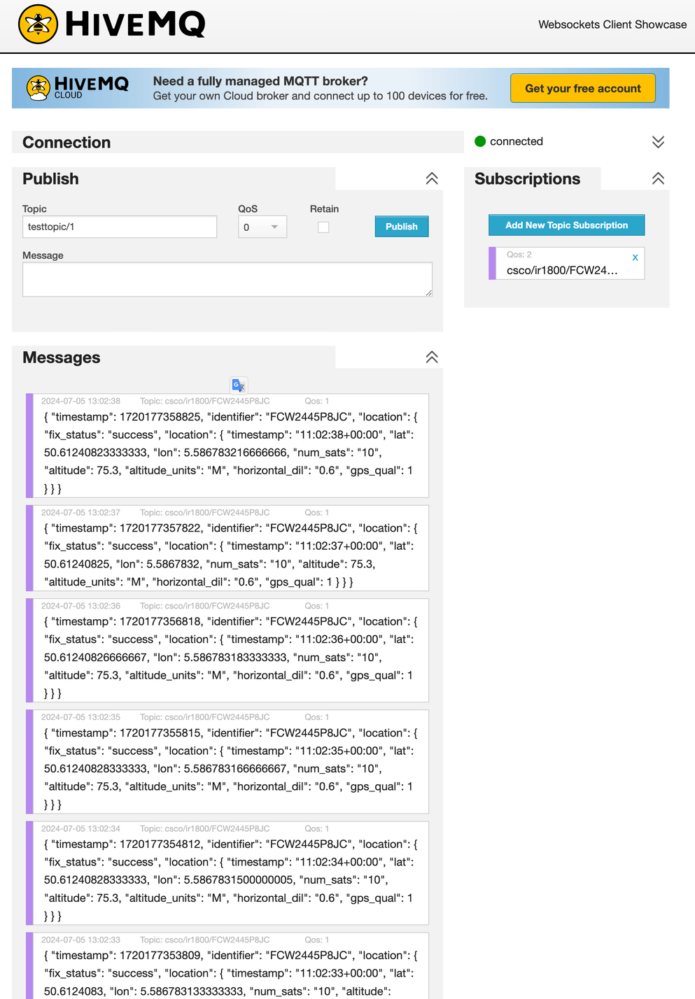
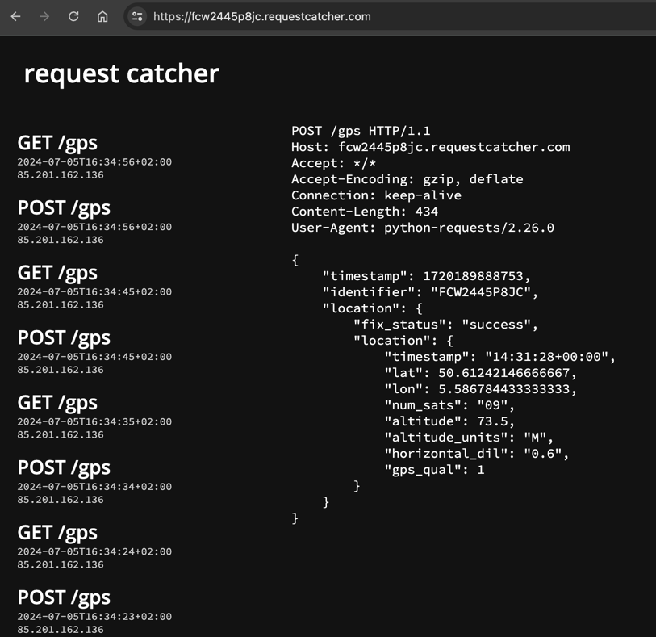

# iox_aarch64_gps

This code builds a Cisco IOx application that gathers GPS information from a cellular module. It runs on Cisco routers such as the Cisco IR1101 or Cisco IR1800, and publishes GPS information to one or more destinations. MQTT and HTTP are supported.

MQTT is efficient because it uses a pub/sub model on a broker. By default the public broker `broker.hivemq.com` is used, but this can be changed at runtime via `package_config.ini` or environment variables.

HTTP is less efficient unless you only need to push coordinates to a single HTTP endpoint.

This IOx app is written in Python and uses a multi-threaded, single-producer / multiple-consumer design with a dictionary of `deque` queues. Queues provide store-and-forward when the network is unavailable.

## List of Changes

* Read the GPS device (`IR_GPS`, typically `/dev/ttyNMEA0`) as a normal file instead of using pySerial
* Split the monolithic main code into producer and consumer threads
* Added support for local router timestamp as well as GPS-sourced timestamps
* Build script (`build.sh`) packages the app; optional auto-increment via `AUTO_INC_VERSION=1`
* Reduced app size by disabling APK caching and trimming the image
* Queue system stores the last position fixes while unable to send data (store and forward)
* Multi-queue mechanism for independent consumers (MQTT and HTTP)

## Todo or Unfinished

* More testing
* More documentation (Local Manager install)
* Add parameters to `package_config.ini` to customize the HTTP consumer
* Add parameters to `package_config.ini` to enable/disable individual consumers

## Building the Code

### Prerequisites

This project has been built on Linux; it should work on other platforms with Docker.

* **ioxclient** installed and in your `PATH`. Download from [Cisco IOx resource downloads](https://developer.cisco.com/docs/iox/iox-resource-downloads/).
* **Docker** (tested with Docker 29.x). Install [Docker Buildx](https://docs.docker.com/build/buildx/) if you build on a non-ARM host (for example x86_64).

On x86_64 build hosts, use an explicit platform:

```bash
docker buildx build --platform linux/arm64 -t iox_aarch64_gps:latest .
```

Or run `./build.sh`, which passes `--platform linux/arm64` to `docker build`.

### Version numbers

* `VERSION` is the source of truth for the tarball name (`iox_aarch64_gps-<version>.tar.gz`).
* `build.sh` updates `package.yaml` to match `VERSION` on every build.
* Set `AUTO_INC_VERSION=1` in `build.sh` to bump the patch segment of `VERSION` automatically before each build (default is `0`).

```bash
./build.sh
```

Produces `iox_aarch64_gps-0.10.tar.gz` when `VERSION` is `0.10`.

## Configuration

At runtime, IOx sets `CAF_APP_CONFIG_FILE` to the app configuration file (typically derived from `package_config.ini`). `startup.sh` loads keys from that file into the environment unless already set.

| Variable | Source | Description |
|----------|--------|-------------|
| `IR_GPS` | IOx device mapping / `run-opts` | Path to the GPS NMEA device (for example `/dev/ttyNMEA0`) |
| `CAF_SYSTEM_SERIAL_ID` | IOx | Router serial number (used in topics and HTTP URL) |
| `CAF_APP_LOG_DIR` | IOx | Log directory (default `/tmp` if unset) |
| `LOOP_INTERVAL` | `package_config.ini` | Seconds between GPS reads |
| `MQTT_*` | `package_config.ini` | Broker, port, credentials, TLS, topic prefix, QoS |
| `DEBUG_VERBOSE` | `package_config.ini` | `1` for debug logging |
| `ALWAYS_REPORT` | `package_config.ini` | `1` to publish even without a valid GPS fix |

See [`package_config.ini`](package_config.ini) for defaults.

### Published JSON payload

Consumers publish a JSON object with:

* `timestamp` — router time (milliseconds)
* `identifier` — router serial number
* `fix_status` — optional (`success`, `no_fix`, `no_stream`) when `ALWAYS_REPORT=1`
* `location` — NMEA-derived fields (`lat`, `lon`, `gps_qual`, etc.)

## Privacy and security notes

### MQTT

The default broker is a **public** MQTT service (`broker.hivemq.com`). Anyone who knows your topic (`<MQTT_BASE_TOPIC>/<serial>`) may be able to subscribe to your GPS data. For production, use a private broker, TLS (`MQTT_USE_TLS=1`), and strong credentials.

### HTTP

The HTTP consumer posts JSON to `http://<serial>.requestcatcher.com/gps` over **cleartext HTTP**. Request Catcher is a public demonstration service; do not use it for sensitive or production location data. See [Request Catcher](https://requestcatcher.com/) for terms of use.

MQTT passwords are not written to logs (only `***` when a password is configured).

## Router prerequisites

* A Cisco router with a cellular [Pluggable Interface Module (PIM)](https://www.cisco.com/c/en/us/products/collateral/networking/industrial-routers-gateways/pim-industrial-iot-routing-portfolio-so.html) with GPS support. GPS works independently of the cellular radio; it does not require cellular signal, a SIM card, or the cellular antenna.
* IOx configured (including DHCP pool, etc.). See the [IR1800 software configuration guide](https://www.cisco.com/c/en/us/td/docs/routers/access/IR1800/software/b-cisco-ir1800-scg.html) if needed.
* The PIM [must have GPS enabled](https://www.cisco.com/c/en/us/td/docs/routers/iot-antennas/cellular-pluggable-modules/b-cellular-pluggable-interface-module-configuration-guide/m-configuring-gps.html).
* A GPS antenna connected (PIM modules provide DC bias; amplified antennas are supported and preferred).
* Internet access to reach the MQTT broker and HTTP endpoint.

## IOx app installation with CLI

For example on a Cisco IR1800, copy the package to bootflash:

```text
router# copy scp://user@192.168.2.3/cisco/iox_aarch64_gps/iox_aarch64_gps-0.10.tar.gz bootflash:
```

Install the app in exec mode:

```text
router# app-hosting install appid gps package flash:iox_aarch64_gps-0.10.tar.gz
```

In configuration mode, set app parameters:

```sh
app-hosting appid gps
  app-vnic gateway0 virtualportgroup 0 guest-interface 0
  app-resource docker
    run-opts 1 "-e DEBUG_VERBOSE=1"
    run-opts 2 "-e IR_GPS=/dev/ttyNMEA0"
    run-opts 3 "--device /dev/ttyNMEA0:/dev/ttyNMEA0"
```

Activate and start in exec mode:

```sh
router# app-hosting activate appid gps
router# app-hosting start appid gps
```

Verify:

```sh
router# show app-hosting list
App id                                   State
---------------------------------------------------------
gps                                      RUNNING
```

## IOx app upgrade with CLI

```text
router# app-hosting upgrade appid gps package flash:iox_aarch64_gps-0.10.tar.gz
```

Wait for confirmation, for example:

```sh
Jul  5 14:28:51.019: %IOXCAF-6-UPGRADE_MSG: R0/0: ioxman: app-hosting: gps: Upgraded Successfully
```

## IOx app installation with Local Manager

See the [Cisco IR1800 software configuration guide](https://www.cisco.com/c/en/us/td/docs/routers/access/IR1800/software/b-cisco-ir1800-scg.html) for IOx app deployment steps in Local Manager.

## Getting the GPS coordinates

### With MQTT

The app publishes to the configured MQTT broker. You can verify with an MQTT client or the [HiveMQ WebSocket client](https://www.hivemq.com/demos/websocket-client/).

1. Connect to the broker (default public broker if unchanged).
2. Subscribe to topic `csco/ir1800/<serial>` (replace `<serial>` with your router serial from `show license udi`).

Example:



### With HTTP

The app POSTs to `http://<serial>.requestcatcher.com/gps`. View captured requests at `https://<serial>.requestcatcher.com/` (for example `https://fcw2445p8jc.requestcatcher.com/`). Note: posts use HTTP; the web viewer may use HTTPS.



## Adding your own consumer

To export data with another protocol:

1. Write a `threading.Thread` subclass that pops from its queue and publishes.
2. Register a dedicated queue in `__init__` with `q.create_new_queue(self.qname, QUEUE_SIZE)`.
3. Instantiate the thread in `__main__` and call `start()`.

Example skeleton:

````python
class ConsumerAcmeThread(threading.Thread):
    def __init__(self, group=None, target=None, name=None,
                 args=(), kwargs=None, verbose=None):
        super(ConsumerAcmeThread,self).__init__()
        self.target = target
        self.name = name
        self.qname = 'acme'
        q.create_new_queue(self.qname, QUEUE_SIZE)
        return
````

```python
    def run(self):
        while True:
            if q.len(self.qname) > 0:
                queue_item = q.pop(self.qname)
                if should_publish(queue_item):
                    payload = build_publish_payload(queue_item)
                    # push payload where you want
            time.sleep(1)
        return
```

## Credits

This code is based on initial work by Kevin Holcomb (Cisco).
